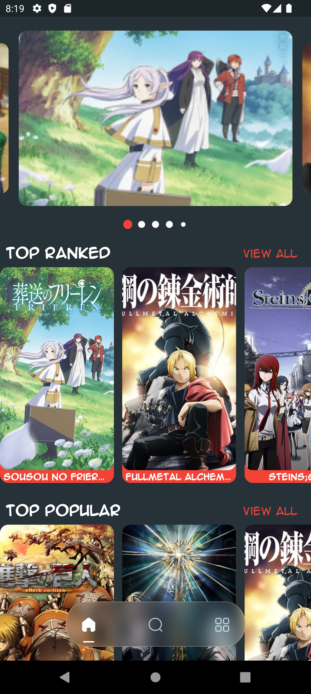
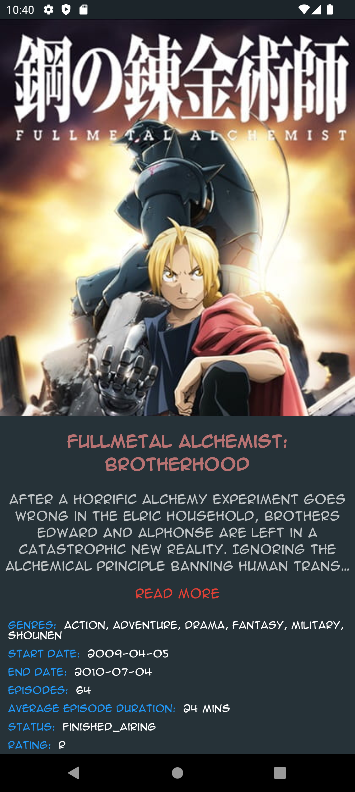
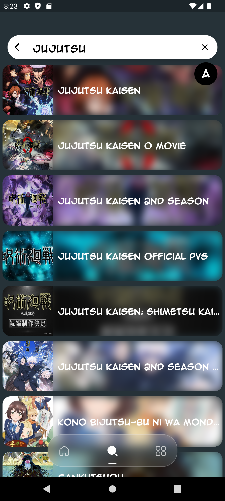

# OtakuNest

[](https://flutter.dev/)

OtakuNest is a Flutter app that provides a comprehensive anime experience. The app fetches data from a RESTful API to showcase various anime categories and details.

## Features

- **Slideshow**: Displays the top 7 anime series, top ranked, top popular, top movies, and top upcoming on the first screen.
- **Search**: A search screen with the ability to change text color.
- **Categories**: Shows different categories of anime including top anime, top airing, top upcoming, top TV series, top OVA, top movies, top specials, top popular, and top favorited.
- **Anime Details**: Clicking on an anime shows the name, description, anime details, gallery, related anime, and recommendations.

## Packages Used

- `anim_search_bar`: ^2.0.3
- `cached_network_image`: ^3.3.1
- `carousel_slider`: ^4.2.1
- `crystal_navigation_bar`: ^1.0.0
- `flutter_bloc`: ^8.1.3
- `flutter_staggered_grid_view`: ^0.7.0
- `gap`: ^3.0.1
- `http`: ^1.2.1
- `iconly`: ^1.0.1
- `shared_preferences`: ^2.2.2
- `smooth_page_indicator`: ^1.1.0

## Screenshots

<div style="display: flex; flex-wrap: wrap;">
    <div style="margin: 10px;">
        <p>Home Screen</p>
        
       
    </div>
    <div style="margin: 10px;">
       <p>Anime Details</p>
        
       
    </div>
    <div style="margin: 10px;">
        <p>Search Screen</p>
        
    </div>
    <div style="margin: 10px;">
        <p>Categories Screen</p>
        
    </div>
</div>

## Getting Started

Follow these instructions to get a copy of the project running on your local machine.

### Prerequisites

- Flutter SDK: [Install Flutter](https://flutter.dev/docs/get-started/install)

### Installation

1. Clone the repository:
   ```bash
   git clone https://github.com/marcolous/Flutter-OtakuNest.git
   ```
2. Navigate to the project directory:
   ```bash
   cd OtakuNest
   ```
3. Install the dependencies:
   ```bash
   flutter pub get
   ```
4. Run the app:
   ```bash
   flutter run
   ```

## Usage

- Explore the top anime series, movies, and more.
- Use the search feature to find your favorite anime.
- Browse through different categories and discover new anime.
- Click on an anime to view detailed information, gallery, related anime, and recommendations.

## Contributing

Contributions are welcome! Please open an issue or submit a pull request for any improvements or bug fixes.

## License

This project is licensed under the MIT License - see the [LICENSE](LICENSE) file for details.

## Contact

If you have any questions or feedback, feel free to reach out to me at [louismarco226@gmail.com](mailto:louismarco226@gmail.com).
